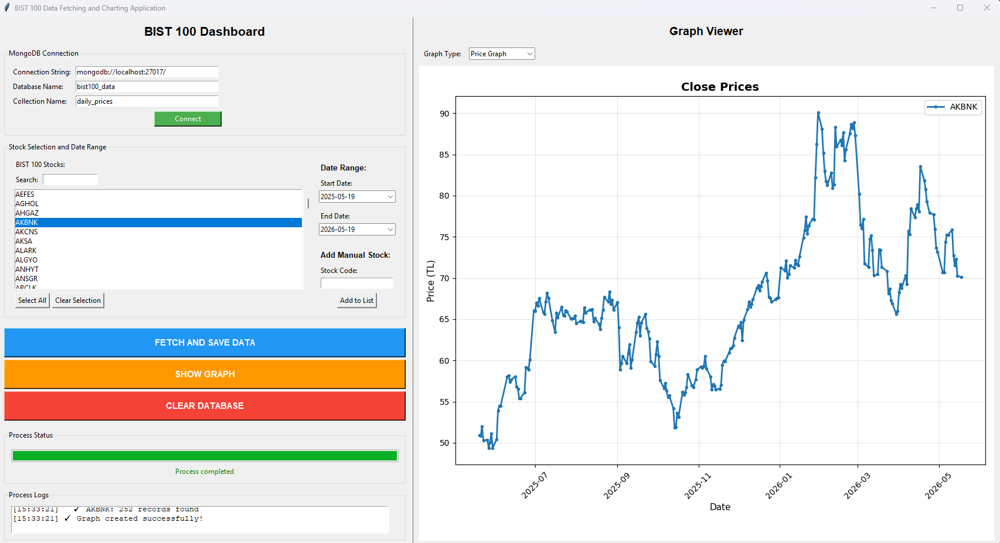

# BIST100-Visual-Analyzer
A high-performance Python GUI dashboard for fetching, managing, and visualizing BIST100 financial data with MongoDB integration and real-time interactive charting.
# BIST100 Visual Data Engine & Analytics Dashboard

A comprehensive, high-performance financial data pipeline and desktop GUI application designed for the Borsa Istanbul (BIST100) market. This system automates the full lifecycle of financial data: from dynamic fetching via Yahoo Finance API to structured storage in MongoDB and interactive visualization.

## 🌟 Overview
This project serves as a robust bridge between real-time financial markets and persistent local analysis. It features a sophisticated GUI that handles complex data operations while providing intuitive charting tools for end-users. It is built to support scalable financial modeling and industrial-grade data reliability.

## 🚀 Key Features
- **Intelligent Data Pipeline:** Automated daily OHLCV fetching for all BIST100 tickers with built-in retry logic.
- **Persistent Storage:** Seamless MongoDB integration featuring "Upsert" logic to ensure data integrity and zero redundancy.
- **Interactive Visualizer:** High-fidelity financial charts powered by Matplotlib, integrated directly into the Tkinter environment.
- **Smart Date Management:** Calendar-based historical range selection for precise data analysis.
- **Advanced Fallback System:** Individual ticker recovery mode to ensure continuous operation even during batch API failures.
- **Live Logging Console:** Real-time feedback on database transactions and network requests.

## 🛠️ Technical Stack
| Category | Technology |
| :--- | :--- |
| **Language** | Python 3.10+ |
| **Database** | MongoDB (NoSQL) |
| **GUI Framework** | Tkinter |
| **Data Analysis** | Pandas, Numpy |
| **Visualization** | Matplotlib |
| **Financial API** | yfinance |

## 📋 Installation & Setup

1. Clone the Project
Bash
git clone https://github.com/AliKajevic/BIST100-Visual-Analyzer.git
2. Install Required Libraries
Bash
pip install yfinance pymongo pandas matplotlib tkcalendar requests
3. Database Connection
Ensure MongoDB is running on mongodb://localhost:27017.

The system automatically initializes the bist100_data database and required collections upon connection.

4. Launch Application
Bash
python "BIST100-Visual-Analyzer.py"
🖥️ Usage Guide
Selection: Choose any BIST100 stock from the searchable dropdown menu.

Range: Define your analysis window using the integrated start/end date pickers.

Sync: Click "FETCH AND SAVE DATA" to update your local MongoDB instance.

Analysis: Use "SHOW GRAPH" to generate interactive performance charts.

Maintenance: Utilize the built-in database cleaning tools for workspace management.

🏗️ Architecture & Goal
Developed with scalability in mind, this project demonstrates a full-stack approach to financial software. It focuses on industrial-grade reliability, utilizing compound indexing in MongoDB and efficient memory management for large datasets. This tool is a core component of my work in ERP systems and financial application development.

Lead Developer: Ali Kajeviç
Management Information Systems Senior Student | Focused on ERP, Financial Software, and Machine Learning.
